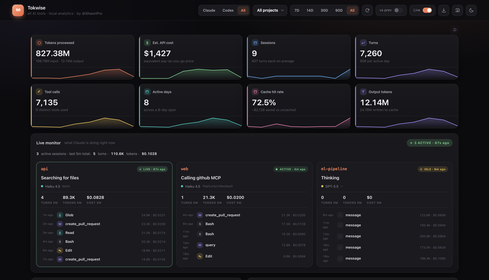
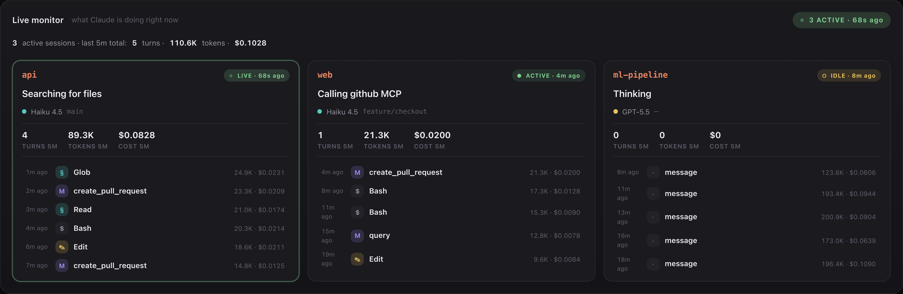
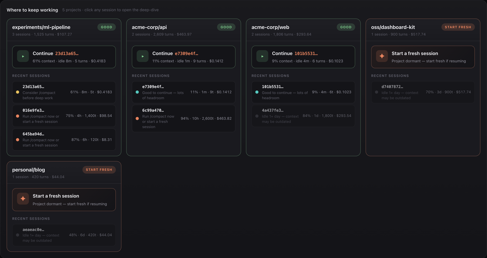
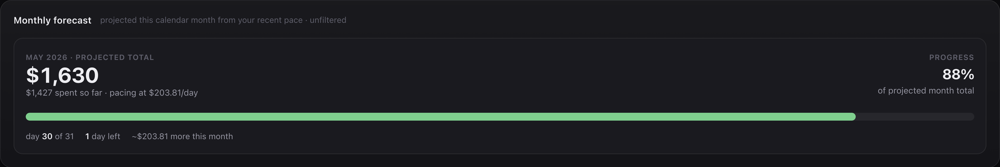
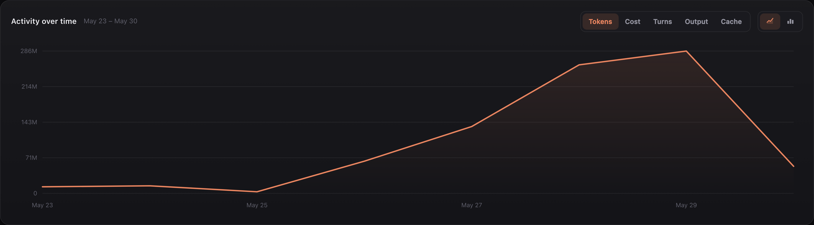
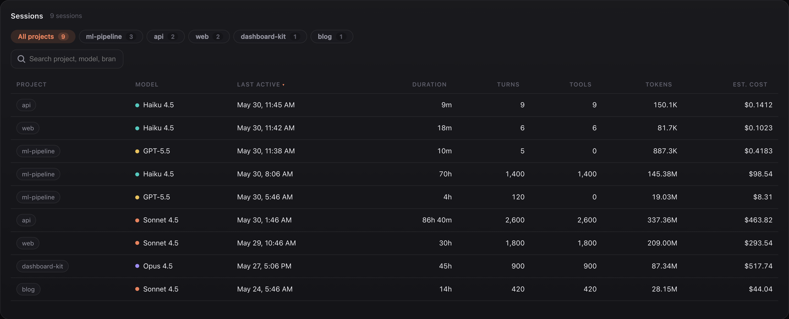
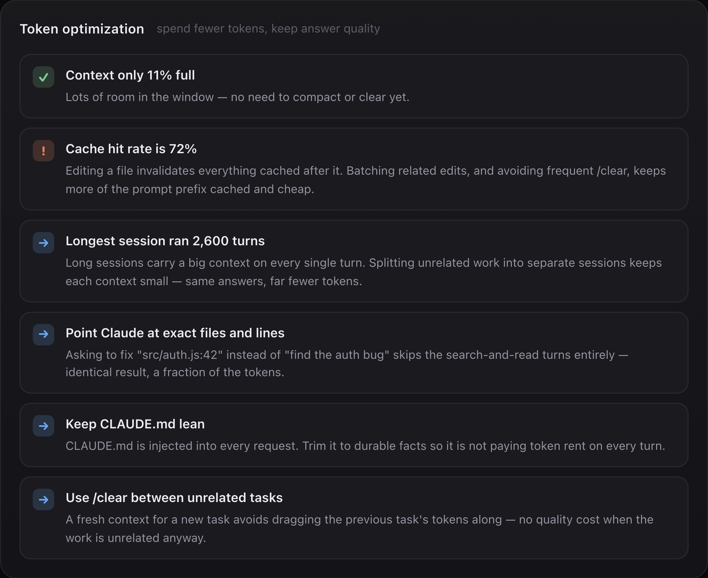
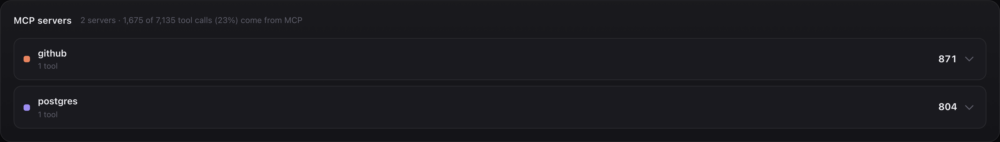

<div align="center">

# ✦ &nbsp; Tokwise

**Local-first usage, cost & live-monitor dashboard for your AI coding tools** —
Claude Code **and** Codex CLI, in one place. KPIs, real-time monitor, cost
forecast, session deep-dive, MCP-server breakdown, and a token-saving advisor.
Everything runs on `127.0.0.1`. Your data never leaves your machine.

[](https://github.com/ShaonPro/Tokwise/actions/workflows/ci.yml)
[](https://nodejs.org)
[](LICENSE)
[]()
[]()
[](CONTRIBUTING.md)

<br/>



</div>

---

## ⚡ &nbsp; One command — plug and play

```bash
npx github:ShaonPro/Tokwise
```

That's it. The dashboard opens in your default browser at <http://127.0.0.1:47776>
(port `47776` — ends in `776` = "PRO" on a phone keypad ✦).
No clone, no install, no `npm install`. Press **Ctrl + C** to stop.

> **Heads-up** — `npx` will ask once to install. Say yes. Subsequent runs are instant.

### Install once, run anywhere

```bash
npm i -g github:ShaonPro/Tokwise

tokwise          # open the web dashboard
tokwise-cli      # full report right in your terminal
```

Re-run the `npm i -g` command to update — npm refetches by commit hash automatically.

### Or — download and double-click

If you don't use npm, clone or download the repo and double-click the launcher for
your OS:

| OS      | Launcher                          |
| ------- | --------------------------------- |
| macOS   | `tokwise.command` *(right-click → Open the first time)* |
| Windows | `tokwise.bat`                |
| Linux   | `./tokwise.sh`               |

### Requirements

- **Node.js 22.13+, 23.4+, or 24+ recommended.** Older 22 / 23 also work —
  the dashboard auto-adds `--experimental-sqlite` for you. Uses Node's built-in
  `node:sqlite`, so **`npm install` is never needed**.
- At least one supported tool used once (see below).

> **Windows note** — the `npx github:` form works in PowerShell, Command Prompt, and Git Bash.
> If you prefer the launcher, double-click `tokwise.bat` after cloning the repo.

### Supported tools

The dashboard auto-detects which tools you have and shows a **Claude · Codex · All**
switcher in the header (it only appears when more than one is present).

| Tool | Reads | Data source |
| --- | --- | --- |
| **Claude Code** | `~/.claude/usage.db` + `~/.claude/projects/**/*.jsonl` | SQLite + live JSONL |
| **Codex CLI** | `~/.codex/sessions/**/rollout-*.jsonl` | live JSONL (parsed in-memory) |

Both are read **read-only**. Cost is computed locally from token counts using
published API list prices — no network, no auth. On Windows the same paths live
under `%USERPROFILE%\.claude\` and `%USERPROFILE%\.codex\`.

> More adapters (Cline, Continue, Aider, Gemini CLI, Cursor) are on the
> [roadmap](ROADMAP.md) — one at a time, only when each is rock-solid.

---

## 🚀 &nbsp; What you get

### Live monitor — what Claude is doing right now

Real-time view of every active Claude Code session, parsed straight from the
JSONL transcripts (`~/.claude/projects/`). Multi-session aware — if you're
running two windows at once, you see them side-by-side, with last-5-minute
turn / token / cost rollups and the most recent tool calls.



### Token-saving advisor — which session to keep, which to abandon

Every project gets a session health audit. Color-coded states
(`fresh` · `healthy` · `getting-full` · `near-max` · `stale` · `abandoned`)
plus a concrete next move: which session to **continue**, which to `/compact`,
which to retire for a fresh start.



### Monthly cost forecast

Knows how many days are left in the month and your recent burn rate.
Tells you the projected end-of-month total before you blow the budget.



### Activity over time

Switchable across **Tokens · Cost · Turns · Output · Cache**, area or bar.
Hover anywhere on the curve for an exact per-day breakdown.



### Sessions table — sortable, searchable, paginated

Every session you've ever run, sorted by recency by default. Filter by
project chip, full-text search across project/model/branch, sort any column,
click any row to open a **deep-dive modal** with per-turn context-size
timeline and tool breakdown.



### Token optimization — fewer tokens, same answers

Context-aware tips: how full the current window is, whether the cache hit
rate is healthy, when to `/compact` vs `/clear`, and durable habits
(point at exact files, keep `CLAUDE.md` lean, split unrelated tasks).



### MCP server breakdown

See exactly which MCP servers your turns hit, with per-tool drill-down.



---

## 🖥️ &nbsp; Terminal mode

```bash
tokwise-cli                          # everything, all time
tokwise-cli --range 7d               # last 7 days  (7d | 14d | 30d | 90d | all)
tokwise-cli --project acme-corp/api  # filter to one project
tokwise-cli --json                   # raw JSON, pipe-friendly
```

*(Or `node cli.js --range 7d` if you didn't install globally.)*

The CLI renders the same KPIs, model/project rankings, top tools,
daily sparkline, and insights with proper ANSI color — perfect for CI logs
or when you don't have a browser handy.

---

## ⚙️ &nbsp; Configuration

| Env var      | Effect                                                                  |
| ------------ | ----------------------------------------------------------------------- |
| `PORT`       | Pick a different port. Auto-tries the next 10 if `47776` is busy.       |
| `NO_OPEN`    | Set to anything truthy to skip auto-opening the browser.                |
| `HOST`       | Override the bind address. Default `127.0.0.1` — **leave it loopback**. |
| `CLAUDE_USAGE_DB` | Point at a different Claude `usage.db`. |
| `CLAUDE_USAGE_PROJECTS_DIR` | Point at a different Claude transcripts dir. |
| `CLAUDE_USAGE_CODEX_DIR` | Point at a different Codex `sessions` dir. |

Examples:

```bash
PORT=8090 npx github:ShaonPro/Tokwise         # custom port
NO_OPEN=1 npx github:ShaonPro/Tokwise         # don't auto-open browser
```

---

## 🔒 &nbsp; Privacy

- Binds to **`127.0.0.1` only** — the dashboard is **not reachable from your network**.
- Database is opened **read-only**. We never write to `~/.claude/usage.db`.
- **Zero external runtime dependencies** — no `npm install`, no CDN fetches at runtime.
- **No telemetry, no analytics, no tracking pixels.** Nothing phones home.
- Cost numbers are estimated **Anthropic API list prices**, not your Claude Code
  subscription bill — shown so you can see the dollar value of the work
  you ran locally.

---

## 🏗️ &nbsp; How it works

```
server.js          Local HTTP server + JSON API (binds to 127.0.0.1)
stats.js           Reads ~/.claude/usage.db + JSONL files, applies pricing,
                   aggregates, classifies session health
dashboard.html     Single-page web UI — vanilla JS, custom SVG charts,
                   no CDN, no build step
cli.js             ANSI-colored terminal dashboard
tokwise.*     One-click launcher per OS
```

The dashboard polls **two endpoints**:

- `GET /api/stats` every 30 s — the heavy aggregates (KPIs, charts, sessions)
  derived from `~/.claude/usage.db`.
- `GET /api/live` every 5 s — the **Live Monitor** reads the most-recently-
  modified `.jsonl` file in `~/.claude/projects/` directly, so it's fresh
  within seconds (the SQLite cache rebuilds on a much slower schedule).

Per-session deep-dive uses `GET /api/session/:id` and parses just that
session's turns.

### Share any card as an image

Hover any card (or the KPI grid) → click the camera icon → pick **PNG**
or **SVG** and one of six gradient backgrounds → get a Mac-window-framed
image with a low-key watermark.

- **PNG** (default) — a real raster image that opens **anywhere**:
  Photoshop, Preview, Slack, X, LinkedIn. Rendered locally via a vendored
  `html2canvas` (no CDN). Also copied to your clipboard for instant paste.
- **SVG** — vector, tiny, lossless — best opened in a browser or Figma.
  (Note: SVG embeds the live DOM via `foreignObject`, which only renders in
  web browsers — use PNG if you need Photoshop/Preview.)

> The screenshots above use fake projects, costs, and models — **no real data
> is ever shown**.

---

## 📦 &nbsp; What's in the repo

| File                       | Purpose                                          |
| -------------------------- | ------------------------------------------------ |
| `server.js`                | Local HTTP server + JSON API                     |
| `stats.js`                 | Data layer — transcripts/SQLite, pricing, aggregation |
| `dashboard.html`           | Single-page web UI                               |
| `cli.js`                   | Terminal dashboard                               |
| `tokwise.command/.bat/.sh`  | One-click launchers per OS                       |
| `html2canvas.min.js`       | Vendored — powers portable PNG capture           |
| `test/stats.test.js`       | Zero-dependency test suite (`node --test`)       |
| `.github/workflows/ci.yml` | CI matrix — Node 22+24 × Ubuntu+Windows+macOS    |

---

## 🤝 &nbsp; Contributing

Contributions are very welcome — the project is small, dependency-free, and
local-first by design. Bug fixes, adapters, and UX polish are all great places
to start.

- 📋 **[CONTRIBUTING.md](CONTRIBUTING.md)** — dev setup, ground rules, PR checklist
- 🗺️ **[ROADMAP.md](ROADMAP.md)** — what's planned next, what's explicitly out of scope
- 🐛 **[Open a bug](https://github.com/ShaonPro/Tokwise/issues/new?template=bug_report.yml)**  ·  ✨ **[Request a feature](https://github.com/ShaonPro/Tokwise/issues/new?template=feature_request.yml)**
- 📜 **[CHANGELOG.md](CHANGELOG.md)** — what's changed across versions
- 💬 **[Code of Conduct](CODE_OF_CONDUCT.md)** — be kind, be specific

Looking for an easy first PR? Check the
[`good first issue`](https://github.com/ShaonPro/Tokwise/labels/good%20first%20issue)
label. Adding a new tool adapter is a particularly contained change — see the
Roadmap.

### Quick dev loop

```bash
git clone https://github.com/ShaonPro/Tokwise && cd Tokwise
node server.js      # runs against your real data on http://127.0.0.1:47776
npm test            # self-contained tests (build their own fixtures, zero deps)
```

## 🔒 &nbsp; Security

The dashboard is built around one promise: **your usage data never leaves your
machine.** That promise is enforced in code — read **[SECURITY.md](SECURITY.md)**
for the line-by-line guarantees, the threat model, and how to responsibly
report a vulnerability (email **hi@shaon.pro**, not a public issue).

---

## 📄 &nbsp; License

MIT — see [LICENSE](LICENSE).

<div align="center">
<br/>

✦ &nbsp; Customized by **[ShaonPro](https://github.com/ShaonPro)** &nbsp; ✦

</div>
